# API Documentation

## _Endpoint Auth_

- Router :

  ```js
  const express = require("express");
  const router = express.Router();

  const {
    addKuesioner,
    getKuesioner,
    jawabKuesioner,
    getHasilKuesioner,
  } = require("../controllers/kuesioner.controller");

  router.post("/add", addKuesioner);
  router.get("/", getKuesioner);
  router.post("/", jawabKuesioner);
  router.get("/hasil", getHasilKuesioner);

  module.exports = router;
  ```

- Controller :

  - register :

    ```js
      register: (req, res) => {
        const user = new User({
          nama: req.body.nama,
          email: req.body.email,
          role: req.body.role,
          password: bcrypt.hashSync(req.body.password, 8),
        });

        user.save((err) => {
          if (err) {
            res.status(500).send({
              message: err,
            });
            return;
            } else {
              res.status(200).send({
                message: "User berhasil register",
            });
          }
        });
      },
    ```

    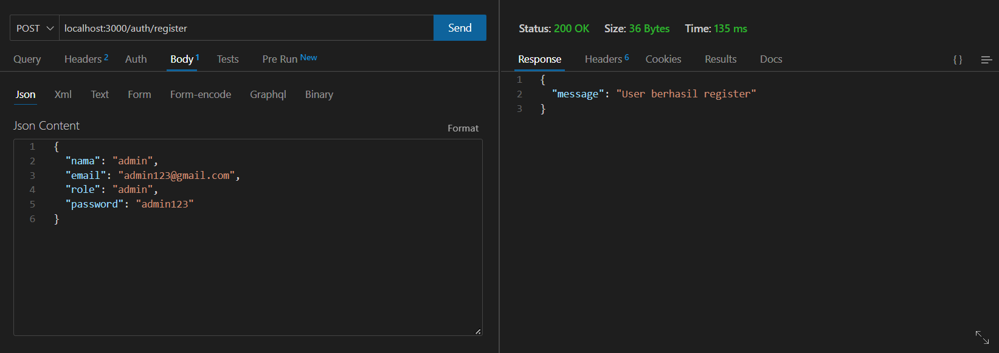
    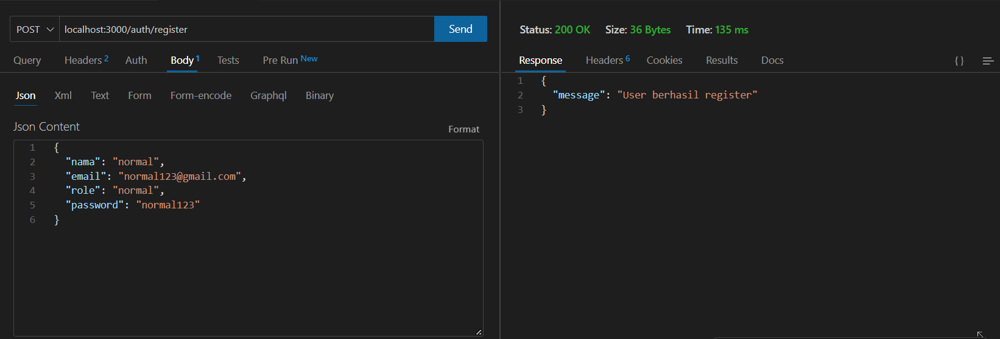

  - login :
    ```js
    login: async (req, res) => {
        const user = await User.findOne({
          email: req.body.email,
        }).exec((err, user) => {
        if (err) {
          res.status(500).json({
            message: err,
          });
          return;
        }
        if (!user) {
          return res.status(404).json({
            message: "User tidak ditemukan",
          });
        }
        const passwordIsValid = bcrypt.compareSync(
          req.body.password,
          user.password
        );
        if (!passwordIsValid) {
          return res.json({
            accessToken: null,
            message: "Password salah",
          });
        }
        const token = jwt.sign(
        {
          id: user.id,
          nama: user.nama,
          email: user.email,
          role: user.role,
        },
        process.env.API_SECRET,
        {
          expiresIn: "1200s",
        }
        );
      res.status(200).json({
        user: {
          id: user._id,
          email: user.email,
          nama: user.nama,
          role: user.role,
        },
        message: "Login berhasil",
        accessToken: token,
      });
    });
    },
    ```
    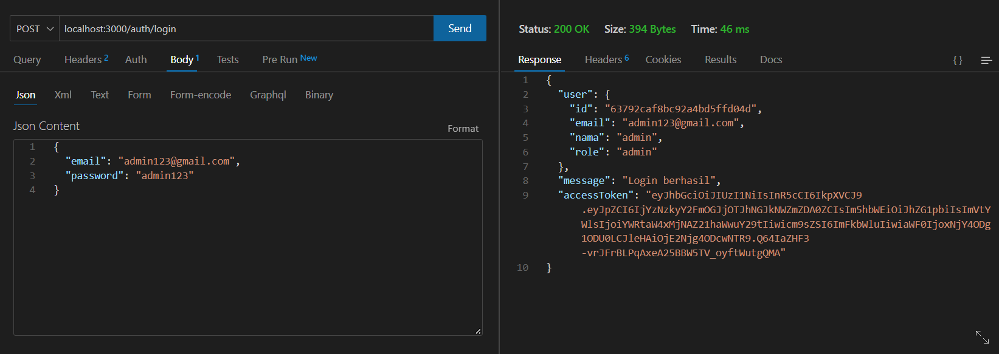

## _Endpoint Kuesioner_

- Router :

  ```js
  const express = require("express");
  const router = express.Router();

  const {
    addKuesioner,
    getKuesioner,
    jawabKuesioner,
    getHasilKuesioner,
  } = require("../controllers/kuesioner.controller");

  router.post("/add", addKuesioner);
  router.get("/", getKuesioner);
  router.post("/", jawabKuesioner);
  router.get("/hasil", getHasilKuesioner);

  module.exports = router;
  ```

- Models :

  - SoalKuesioner :

    ```js
    const mongoose = require("mongoose");
    const { Schema } = mongoose;

    const SoalKuesionerSchema = new Schema({
      pertanyaan: {
        type: String,
        required: true,
      },
    });

    const SoalKuesioner = mongoose.model("SoalKuesioner", SoalKuesionerSchema);

    module.exports = SoalKuesioner;
    ```

  - HasilKuesioner :

    ```js
    const mongoose = require("mongoose");
    const SoalKuesioner = require("./soalkuesioner");
    const User = require("./user");
    const { Schema } = mongoose;

    const HasilKuesionerSchema = new Schema({
      id_user: {
        type: String,
        required: true,
        references: [{ type: Schema.Types.ObjectId, ref: User }],
      },
      hasil: [
        {
          id_soal: {
            type: String,
            required: true,
            references: [{ type: Schema.Types.ObjectId, ref: SoalKuesioner }],
          },
          jawaban: {
            type: String,
            enum: ["Tidak pernah", "Jarang", "Kadang-kadang", "Sering"],
          },
          bobot: {
            type: Number,
            enum: [1, 2, 3, 4],
          },
        },
      ],
    });

    const HasilKuesioner = mongoose.model(
      "HasilKuesioner",
      HasilKuesionerSchema
    );

    module.exports = HasilKuesioner;
    ```

- Controller :

  - addKuesioner :

    ```js
    addKuesioner: (req, res) => {
      const data = req.body;
      const kuesioner = new SoalKuesioner(data);

      kuesioner.save();

      res.status(200).json({
        message: "Kuesioner berhasil ditambahkan",
      });
    },
    ```

    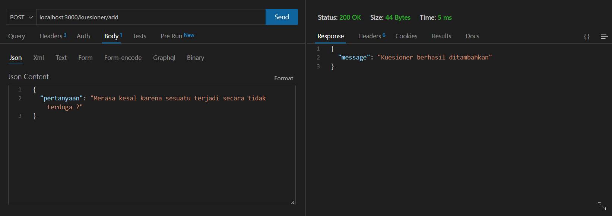

  - getKuesioner :

    ```js
    getKuesioner: async (req, res) => {
      try {
        const auth = req.headers.authorization;
        const token = auth.split(" ")[1];
        const user = jwt.verify(token, process.env.API_SECRET);
        const kuesioner = await SoalKuesioner.find({}, "-__v");
        res.status(200).json({
          message: "Berhasil mendapat data pertanyaan",
          data: kuesioner,
        });
      } catch (err) {
        res.status(500).json({
          message: "Silahkan login terlebih dahulu",
        });
      }
    },

    ```

    - Masukkan token yang didapat setelah login pada headers authorization
      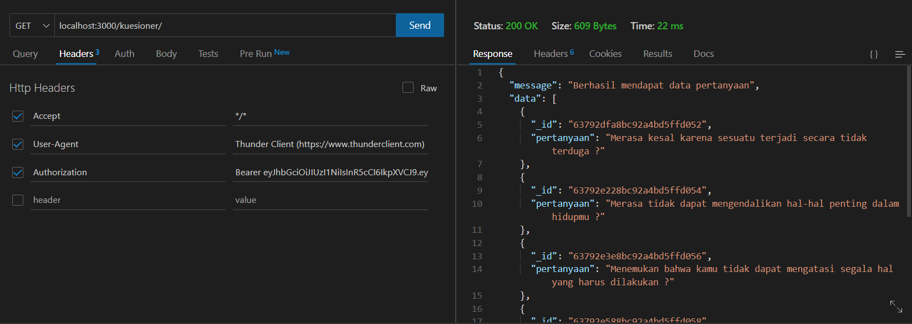

  - jawabKuesioner :

    ```js
    jawabKuesioner: async (req, res) => {
    try {
        const auth = req.headers.authorization;
        const token = auth.split(" ")[1];
        const user = jwt.verify(token, process.env.API_SECRET);
        const data = req.body;
        const kuesioner = new HasilKuesioner(data);

        kuesioner.save();

        res.status(200).json({
          message: "Selesai menjawab pertanyaan",
        });
      } catch (err) {
        res.status(500).json({
          message: "Silahkan login terlebih dahulu",
        });
      }
    },

    ```

    - Masukkan token yang didapat setelah login pada headers authorization
      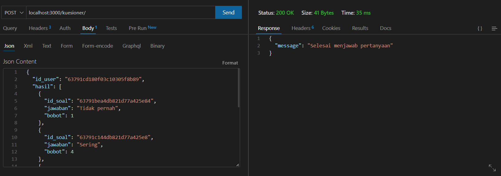

  - getHasilKuesioner

    ```js
    getHasilKuesioner: async (req, res) => {
      try {
        const auth = req.headers.authorization;
        const token = auth.split(" ")[1];
        const user = jwt.verify(token, process.env.API_SECRET);
        const kuesioner = await HasilKuesioner.find({ id_user: user.id }, "-__v");
        res.status(200).json({
          message: "Berhasil mendapatkan hasil kuesioner",
          data: kuesioner,
        });
      } catch (err) {
        res.status(500).json({
         message: "Silahkan login terlebih dahulu",
        });
      }
    },

    ```

    - Masukkan token yang didapat setelah login pada headers authorization
      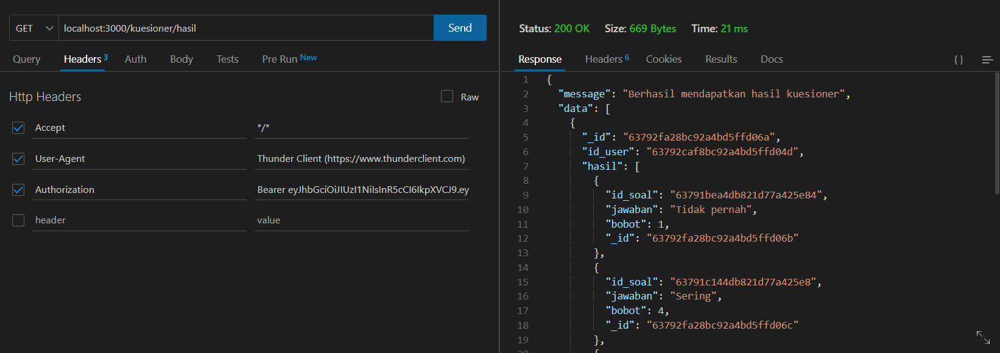

## _Endpoint Psikolog_

- Router :

  ```js
  const express = require("express");
  const router = express.Router();

  const {
    getAllPsikolog,
    addPsikolog,
    updatePsikolog,
    deletePsikolog,
  } = require("../controllers/psikolog.controller");

  router.get("/", getAllPsikolog);
  router.post("/", addPsikolog);
  router.patch("/:id", updatePsikolog);
  router.delete("/:id", deletePsikolog);

  module.exports = router;
  ```

- Model :

  ```js
  const mongoose = require("mongoose");
  const { Schema } = mongoose;

  const psikologSchema = new Schema({
    nama: {
      required: true,
      type: String,
    },
    pengalaman: {
      required: true,
      type: String,
    },
  });

  const Psikolog = mongoose.model("Psikolog", psikologSchema);

  module.exports = Psikolog;
  ```

- Controller :

  - getAllPsikolog (Menampilkan semua list psikolog) :

    ```js
        getAllPsikolog: async (req, res) => {
    try {
        const psikolog = await Psikolog.find({}, "-password -__v");

        res.status(200).json({
        message: "success get data psikolog",
        data: psikolog,
        });
    } catch (error) {
        console.log(error);
    }
    },
    ```

    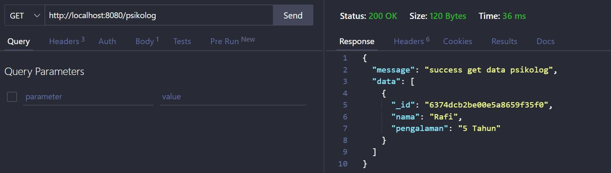

  - getDetailPsikolog (Mendapatkan detail dari masing-masing psikolog berdasarkan id) :

    ```js
    try {
      const { id } = req.params;
      const psikolog = await Psikolog.findById(id, "-__v -_id");

      res.status(200).json({
        message: "success get data user",
        data: psikolog,
      });
    } catch (error) {
      console.log(error);
    }
    ```

    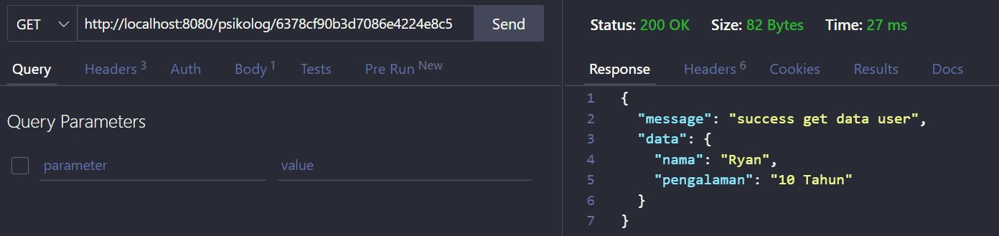

  - addPsikolog (Menambahkan data psikolog baru) :

    ```js
    addPsikolog: (req, res) => {
    const data = req.body;
    const psikolog = new Psikolog(data);

    psikolog.save();

    res.status(200).json({
      message: "Psikolog baru berhasil ditambahkan !",
    });
    },
    ```

    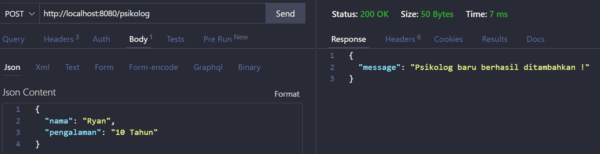

  - updatePsikolog (Mengupdate data psikolog berdasarkan id) :

    ```js
    updatePsikolog: async (req, res) => {
    const { id } = req.params;
    const data = req.body;

    const psikolog = await Psikolog.findByIdAndUpdate(id, data);

    await psikolog.save();

    res.status(200).json({
      message: "Data berhasil di Update !",
    });

    psikolog.save();
    },
    ```

    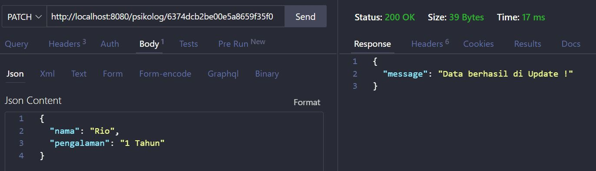

    - Setelah kita update dan get data kembali :

    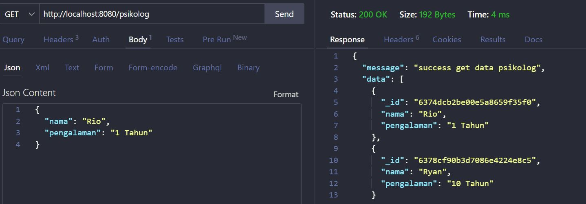

  - deletePsikolog (Menghapus psikolog berdasarkan id) :

    ```js
    deletePsikolog: async (req, res) => {
      const { id } = req.params;
      const psikolog = await Psikolog.findById(id);

      await psikolog.remove();
      res.json({
        message: "Data yang dipilih berhasil dihapus !",
        data: "terhapus",
      });
    };
    ```

    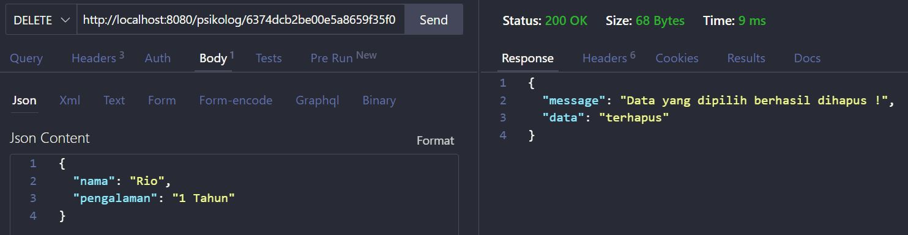

    - Setelah kita melakukan delete data dan get data kembali :

    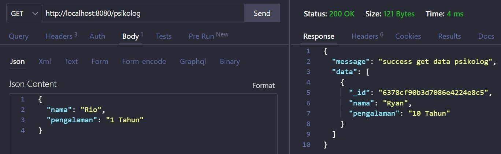

## _Endpoint User_

- Router

  ```js
  const express = require("express");
  const router = express.Router();

  const {
    getAllUser,
    profile,
    deleteUser,
    admin,
    updateByID,
    deleteByID,
  } = require("../controllers/user.controller");

  router.get("/allUser", getAllUser);
  router.get("/profile", profile);
  router.delete("/deleteUser", deleteUser);
  router.get("/admin", admin);
  router.patch("/:id", updateByID);
  router.delete("/:id", deleteByID);

  module.exports = router;
  ```

- Controller :

  - getAllUser :

    ```js
    try {
      const auth = req.headers.authorization;
      const token = auth.split(" ")[1];
      const user = jwt.verify(token, process.env.API_SECRET);
      if (user.role == "admin") {
        const users = await User.find({}, "-__v -password");
        res.status(200).json({
          message: "Data user",
          data: users,
        });
      } else {
        res.status(400).json({
          message: "Anda bukan admin",
        });
      }
    } catch (err) {
      res.status(500).json({
        message: "Silahkan login terlebih dahulu",
      });
    }
    ```

    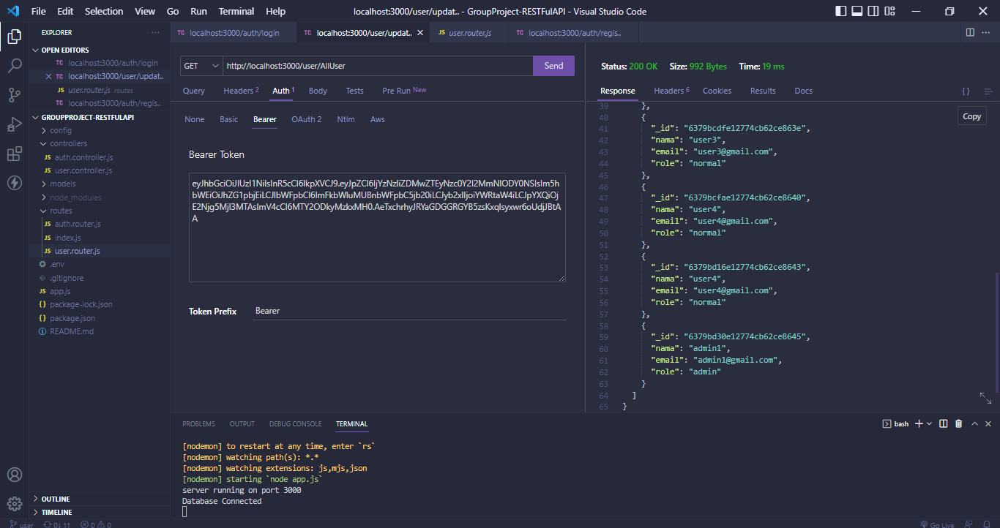

  - profile :

    ```js
    try {
      const auth = req.headers.authorization;
      const token = auth.split(" ")[1];
      const user = jwt.verify(token, process.env.API_SECRET);
      const users = await User.find({ _id: user.id }, "-__v -password");
      res.status(200).json({
        message: "Data user",
        data: users,
      });
    } catch (err) {
      res.status(500).json({
        message: "Silahkan login terlebih dahulu",
      });
    }
    ```

    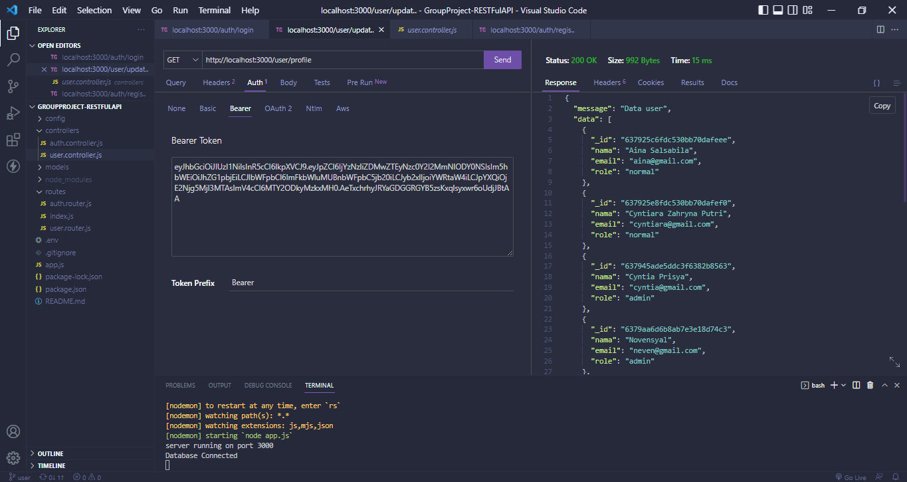

  - deleteUser :

    ```js
    try {
      const auth = req.headers.authorization;
      const token = auth.split(" ")[1];
      const user = jwt.verify(token, process.env.API_SECRET);
      await User.findOneAndDelete({ _id: user.id });
      res.status(200).json({
        message: "User berhasil dihapus",
      });
    } catch (err) {
      res.status(500).json({
        message: "Silahkan login terlebih dahulu",
      });
    }
    ```

    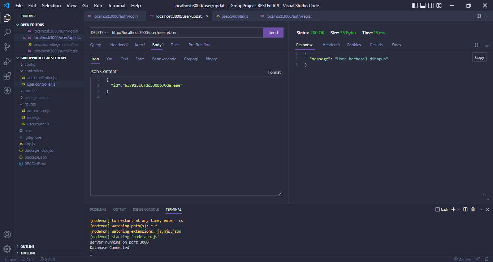

  - admin :

    ```js
    try {
      const auth = req.headers.authorization;
      const token = auth.split(" ")[1];
      const user = jwt.verify(token, process.env.API_SECRET);
      if (user.role == "admin") {
        res.status(200).json({
          message: "Ini halaman admin",
        });
      } else {
        res.status(500).json({
          message: "Anda bukan admin",
        });
      }
    } catch (err) {
      res.status(500).json({
        message: "Silahkan login sebagai admin",
      });
    }
    ```

    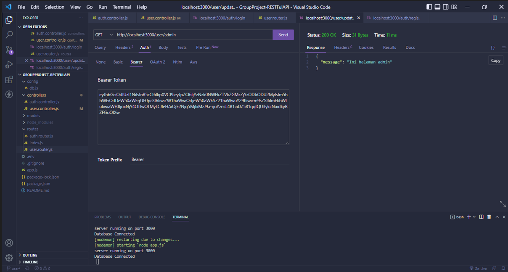

  - updateByID :

    ```js
    const { id } = req.params;
    const data = req.body;

    const user = await User.findByIdAndUpdate(id, data);

    await user.save();

    res.status(200).json({
      message: "Data berhasil di Update !",
    });

    user.save();
    ```

    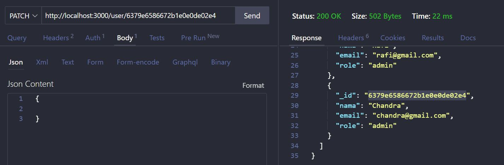
    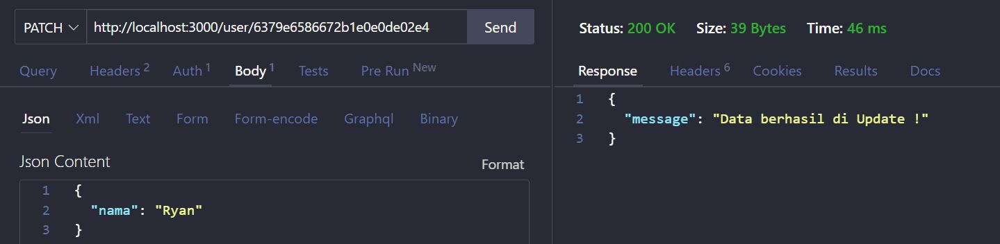
    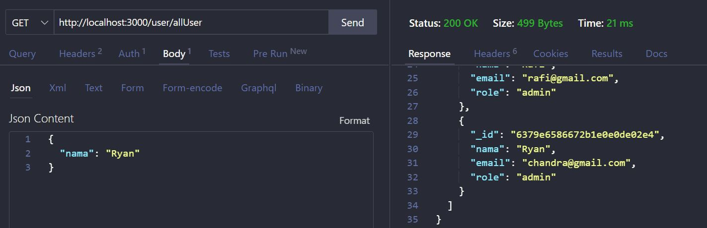

  - deleteByID :

    ```js
    const { id } = req.params;

    const user = await User.findById(id);

    await user.remove();
    res.json({
      message: "Data yang dipilih berhasil dihapus !",
      data: "terhapus",
    });
    ```

    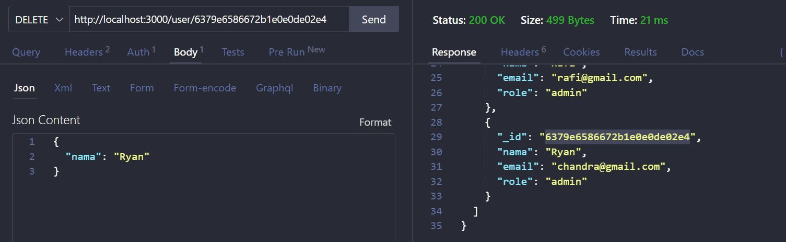
    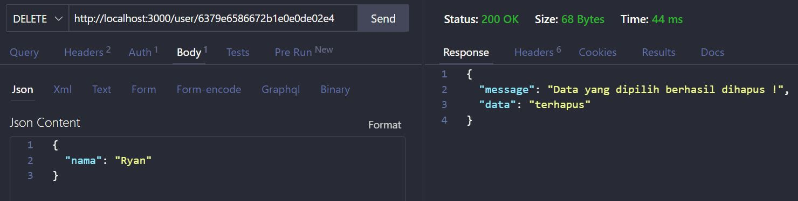
